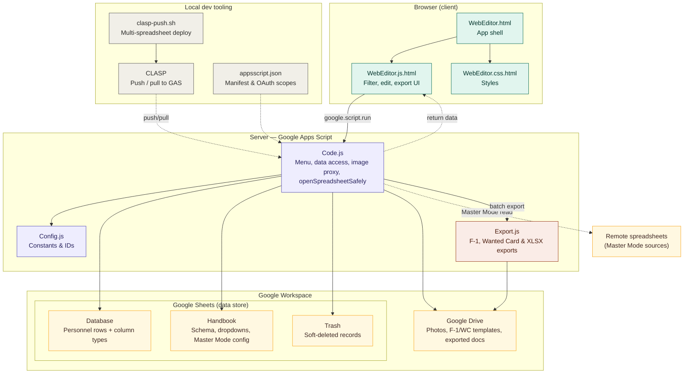

# Personnel Database

A Google Sheets–based personnel database with a built-in web editor. Data lives in a Google Sheet; the web editor provides a richer UI for browsing, editing, and exporting records.

## How it works

The project is a [Google Apps Script](https://developers.google.com/apps-script) bound to a Google Spreadsheet, deployed locally with [CLASP](https://github.com/google/clasp).



| File | Purpose |
|------|---------|
| `Config.js` | All constants — sheet names, column names, Drive IDs, export settings |
| `Code.js` | Server-side script: menu, data access, image proxy |
| `Export.js` | Server-side export logic for F-1 and Wanted Card documents, and the single-file XLSX export |
| `WebEditor.html` | Client app shell; includes CSS and JS via `<?!= HtmlService.createHtmlOutputFromFile(...) ?>` |
| `WebEditor.css.html` | Styles for the web editor |
| `WebEditor.js.html` | Client-side logic for the web editor |

## Spreadsheet structure

### `Database` sheet

| Row | Purpose |
|-----|---------|
| 1 | Column names |
| 2 | Column types (`text`, `image`, `date`, `number`, `unit`, `tin`, `relatives-table`, `service-table`, …) |
| 3+ | Data rows |

### `Trash` sheet

Same structure as `Database` (row 1 = column names, row 2 = column types, row 3+ = data rows). Deleted records are appended here instead of being permanently removed. The sheet is created automatically on first delete if it does not exist.

### `Handbook` sheet

| Range | Purpose |
|-------|---------|
| `A2:K15` (`HANDBOOK_TYPES_RANGE`) | Sub-column headers for each `*-table` type; col A = type name, col B onward = headers |
| `M2` (`MASTER_MODE_CELL`) | Master Mode toggle (checkbox) — when checked, the webview aggregates data from all source spreadsheets listed in `N2:N` |
| `M4` (`DATA_FOLDER`) | Google Drive folder ID that contains person images and PDFs |
| `M6` (`ACTUAL_PERSONNEL_SPREADSHEET_CELL`) | Link or bare ID of the spreadsheet that holds the authoritative personnel list |
| `M7` (`ACTUAL_PERSONNEL_RANGE_CELL`) | Range address within that spreadsheet (e.g. `Sheet1!A:A`) containing full names |
| `M9` (`EXPORT_F1_TEMPLATE_CELL`) | Google Drive file ID (or shareable link) of the F-1 Docs template |
| `M11` (`EXPORT_WC_TEMPLATE_CELL`) | Google Drive file ID (or shareable link) of the Wanted Card Docs template |
| `M13` (`EXPORT_FOLDER_CELL`) | Google Drive folder ID (or shareable link) where exported documents are saved |
| `N2:N` (`MASTER_MODE_SOURCES_RANGE`) | Source spreadsheet IDs — one per row; used when Master Mode is ON |
| `A17:C40` (`HANDBOOK_CORR_RANGE`) | Placeholder correspondence table for document exports |
| `D17:D40` (`HANDBOOK_UNIT_RANGE`) | Allowed values for `unit`-type columns |
| `E17:E40` (`HANDBOOK_ORIGIN_RANGE`) | Allowed values for `origin`-type columns |
| `F17:F40` (`HANDBOOK_MARITAL_STATUS_RANGE`) | Allowed values for `marital-status`-type columns |
| `G17:G40` (`HANDBOOK_SEX_RANGE`) | Allowed values for `sex`-type columns |

#### Correspondence table columns

| Column | Purpose |
|--------|---------|
| A | Placeholder name (used as `{placeholder}` in the template) |
| B | Source Database column name (value is copied directly) |
| C | Computed value key (see [Computed values](#computed-values) below) |

Exactly one of B or C should be filled per row.

## Column types

| Type | List view | Edit view |
|------|-----------|-----------|
| `text` | Plain text | Text input |
| `image` | Thumbnail (click to enlarge) | Google Drive link input with live preview |
| `date` | Plain text | Text input with `DD.MM.YYYY` format validation |
| `tin` | Plain text | Text input validated as exactly 10 digits |
| `number` | Plain text | Text input validated as digits only |
| `unit` | Plain text | Dropdown of allowed values from Handbook `D17:D40` |
| `origin` | Plain text | Dropdown of allowed values from Handbook `E17:E40` |
| `marital-status` | Plain text | Dropdown of allowed values from Handbook `F17:F40` |
| `sex` | Plain text | Dropdown of allowed values from Handbook `G17:G40` |
| `*-table` | Decoded mini-table | Row/column editor with add & delete |

### `*-table` encoding format

Table data is stored in a single cell as a pipe-and-newline delimited string:

```
value1 | value2 | value3
value1 | value2 | value3
```

### Image columns

Images are stored as Google Drive sharing links. Supported URL formats:

- `https://drive.google.com/file/d/FILE_ID/view`
- `https://drive.google.com/drive/folders/FOLDER_ID`
- `https://drive.google.com/open?id=FILE_ID`
- Bare file ID

Images are fetched server-side (via `DriveApp`) and returned as base64 data URLs, so all users with access to the spreadsheet can view images regardless of their personal Drive session.

Fetched images are persisted in an **IndexedDB** database (`pdb_images`) so subsequent dialog opens display all thumbnails immediately without any server round-trips. Entries expire after `IMAGE_CACHE_TTL_DAYS` (default 7 days). To force a full re-fetch, clear the site data for the script origin in browser DevTools.

If the linked file is a **PDF**, the cell shows a red "PDF" badge instead of a thumbnail; clicking it opens the file in Drive in a new tab. If the link points to a **Drive folder**, a blue "Folder" badge is shown instead. If the script owner does not have access to the linked file, a gray **"No access"** badge is shown.

### Date columns

Values are stored as plain text in `DD.MM.YYYY` format. In the edit view, the input validates the format on every keystroke and highlights the field in red with an error hint if the format is wrong. The Save button is blocked until all date fields are valid (empty values are allowed).

Values entered directly in the sheet that do not match the format are displayed as-is; no validation is applied outside the web editor.

### TIN columns

Values are stored as plain text. In the edit view, the input validates on every keystroke that the value is exactly 10 digits (digits only, no spaces or other characters). The Save button is blocked until all TIN fields are valid (empty values are allowed).

Values entered directly in the sheet that do not match the format are displayed as-is; no validation is applied outside the web editor.

### Unit columns

Allowed values are read from Handbook `D17:D40` at page load and served to the client as part of the schema. In the edit view the field renders as a dropdown containing only those values. Values entered directly in the sheet that are not in the allowed list are appended to the dropdown as an extra option and shown selected, so no data is lost.

### Origin columns

Same behaviour as `unit`, but the allowed values come from Handbook `E17:E40`.

### Marital-status columns

Same behaviour as `unit`, but the allowed values come from Handbook `F17:F40`.

### Sex columns

Same behaviour as `unit`, but the allowed values come from Handbook `G17:G40`.

## Master Mode

When the **Master Mode** checkbox (`Handbook!M2`) is checked, `getSchemaAndData()` returns the source spreadsheet IDs listed in `Handbook!N2:N` (`masterSourceIds`) without opening any of them itself, so the local `Database` rows render immediately. The client then calls `queueMasterSourceFetch()`, which fetches each source's rows one at a time through a concurrency-limited worker pool (`MASTER_MODE_FETCH_CONCURRENCY` in `Config.js`) via `getMasterSourceRows(spreadsheetId)`. Each remote row carries a `spreadsheetId` property so saves and deletes are routed back to the correct spreadsheet. As each source resolves, its rows are appended to the list and the view is silently re-filtered — so remote rows stream in over the following seconds while the local-only list is already visible. Inaccessible sources are skipped silently.

Before accepting a remote source's rows, `getMasterSourceRows()` compares the remote sheet's column names and types (rows 1 and 2) against the local `Database` sheet. If they differ, the source's rows are **not loaded** and an amber **⚠** warning button appears to the left of the "All Units" checkbox in the toolbar. Clicking it opens a dialog listing each mismatched source by name and each differing column by its spreadsheet letter (A, B, C…) alongside the local and remote header names. Sources with a matching schema load normally.

The displayed list is always sorted: local spreadsheet rows first, then each remote source in the order it appears in `Handbook!N2:N`, with rows within each source in their original sheet row order. This sort runs on every filter pass, so the order is stable even while sources are still loading.

The **"All units"** toolbar checkbox (visible only in Master Mode, checked by default) hides all streamed-in remote rows so only the local `Database` sheet's own rows are shown.

The green **Refresh** button (visible only in Master Mode, to the left of "All units") re-runs the same load — local rows plus every Master Mode source — without closing the dialog, so updates made by other admins in a source spreadsheet since the dialog was opened become visible. It preserves current filter text and column visibility, but clears the row selection checkboxes (row positions may have shifted upstream). Clicking it again while a previous refresh's remote sources are still streaming in safely discards the stale results instead of duplicating rows.

When Master Mode is **OFF**, only the local `Database` sheet is shown. Editing (add / edit / delete) is always available regardless of Master Mode.

New rows added via **Add person** always go to the local `Database` sheet, never to a remote source.

### Move personnel (Master Mode only)

The **Move** toolbar button appears only when Master Mode is on. Select one or more rows with the checkbox column, click **Move**, pick a destination spreadsheet from the dropdown, and confirm.

What happens on the server:
1. The row is appended to the destination `Database` sheet and **hard-deleted** from the source (not sent to Trash).
2. The person's Drive folder — searched by full name (first column) inside the source `DATA_FOLDER` — is moved to the destination `DATA_FOLDER` using `DriveApp`. If the folder is not found or `DATA_FOLDER` is not configured in either spreadsheet the row move still completes; the result dialog shows a per-person note.
3. Rows that already belong to the destination spreadsheet are skipped.

After a successful move the rows reappear in the list immediately under their new spreadsheet, without reopening the webview.

## Custom menu

The Sheets **More... ⭐️** menu (added by `onOpen()`) has three items:

| Item | Action |
|------|--------|
| Open Web Editor | Opens the web editor dialog described below |
| Fix phone numbers | Scans the `Database` sheet's `Номер телефону` column and rewrites two malformed shapes in place: bare 9-digit numbers missing the leading `0`, and 12-digit numbers carrying a `38` country-code prefix. Numbers already in canonical 10-digit form are left untouched. Runs synchronously over the whole sheet and reports the fixed count via a dialog. No undo beyond manual edit or `Trash` recovery. |
| Fix full names | Scans the `Database` sheet's `ПІБ` column and rewrites each value: trims surrounding whitespace, collapses internal whitespace runs (including newlines) to a single space, and uppercases the surname (first word). Already-normalized values are left untouched. Runs synchronously over the whole sheet and reports the fixed count via a dialog. No undo beyond manual edit or `Trash` recovery. |

## Web editor features

- **List view** — full-screen table with all columns and data
- **Filtering** — debounced live filter input above every column; supports plain text and regular expressions (toggle per session); for `image` columns the search matches the raw Drive URL/ID (`""` to filter empty); for `*-table` columns the search runs against the raw encoded cell content, so any sub-field value is matched
- **Actual personnel filter** — "Actual personnel" checkbox in the toolbar (enabled only when `Handbook!M6`/`M7` are configured and accessible); when checked, only rows whose first-column value (full name) appears in the external personnel list are shown; composes with all other filters
- **All units filter** (Master Mode only) — "All units" checkbox in the toolbar, checked by default; uncheck to hide rows streamed in from Master Mode source spreadsheets and show only the local `Database` sheet's rows; composes with all other filters. An amber ⚠ button appears to its left when one or more remote sources have a column schema mismatch; clicking it shows which columns differ so the issue can be fixed in the remote sheet
- **Refresh** (Master Mode only) — green button to the left of "All units"; re-fetches local rows and every Master Mode source without closing the dialog, so changes made by other admins become visible; preserves filter text and column visibility, clears row selection
- **Reset** — orange button to the left of Refresh, always visible; clears all column filters, the regex/"Actual personnel"/"All units" toggles, hidden-column visibility, and the row selection checkboxes back to their defaults, without re-fetching data from the server
- **Add person** — appends a new empty row to the local `Database` sheet and opens it in the edit view immediately
- **Delete** — red "Delete" button in the edit view moves the record to the `Trash` sheet of its source spreadsheet (not available for unsaved new rows)
- **Unsaved changes confirmation** — clicking "Back" in the edit view with pending edits (including `*-table` fields) shows a "Keep Editing" / "Discard Changes" prompt instead of silently discarding them; no prompt if nothing changed
- **Column visibility** — "Columns ▾" button to hide/show individual columns; first column is always visible
- **Image thumbnails** — loaded asynchronously; persisted in IndexedDB so subsequent opens display instantly
- **Lightbox** — click any thumbnail to view the full image
- **Row selection** — checkbox column at the left of the table; master checkbox in the filter row selects/deselects all visible rows; indeterminate state when a subset is selected; drives which rows are exported and moved
- **Export XLSX** — exports the selected rows, restricted to currently visible columns, as a single `.xlsx` file (see [XLSX export](#xlsx-export))
- **Move** (Master Mode only) — moves selected rows to another spreadsheet and relocates the person's Drive folder; button is hidden when Master Mode is off
- **Edit view** — click a name in the first column to open a per-record editor

## Document export

Two export types are available from the toolbar. Both operate on the **selected** rows (rows checked via the checkbox column). The export buttons are disabled until at least one row is selected.

| Button | Template cell | Output prefix |
|--------|---------------|---------------|
| Export F-1 | `Handbook!M9` (`EXPORT_F1_TEMPLATE_CELL`) | `Ф-1 ` |
| Export WC | `Handbook!M11` (`EXPORT_WC_TEMPLATE_CELL`) | `Розшукова картка ` |

Exported files are saved to the Google Drive folder configured in `Handbook!M13` (`EXPORT_FOLDER_CELL`). Each cell accepts either a bare Drive ID or a full shareable link.

### How export works

Placeholders in the template use the format `{Column Name}`. Four passes run per document:

1. **Images** — `image`-type column placeholders are replaced with a compressed image blob
2. **Service history table** — `{Проходження служби}` is expanded into one table row per entry
3. **Direct text** — remaining `{Column Name}` placeholders are replaced with cell values
4. **Correspondence table** — Handbook-defined aliases and computed values fill any remaining placeholders

After all passes, the marital status line is underlined based on the `Сімейний стан` value.

### Image compression

Google Docs embeds an inserted image's actual bytes regardless of the display size set afterward, so inserting a full-resolution photo (often several MB) made exported documents unnecessarily large even though they only displayed at `IMAGE_MAX_HEIGHT` px tall. Image placeholders are now filled with a resized thumbnail fetched via the Advanced Drive Service (`Drive.Files.get(fileId, {fields: 'thumbnailLink'})`, enabled in `appsscript.json`) requested at `EXPORT_IMAGE_THUMBNAIL_SIZE` px wide, rather than the original file. If the Drive advanced service or thumbnail fetch fails for any reason, export falls back to the original full-resolution blob, so this never breaks or blanks an export.

### Computed values

These keys can be placed in column C of the correspondence table:

| Key | Description |
|-----|-------------|
| `totalServiceLength` | Duration from last date in `Дата призову` to today, e.g. `3 роки, 8 місяців, 17 днів (станом на 09.05.2026)` |
| `contractSignDate` | First date in `Дата призову` + unit number from first service entry, e.g. `07.05.2015 з в/ч 3011` |
| `currentPosition` | Position title from the last entry in `Проходження служби` |
| `currentPositionStartDate` | Start date of the last entry in `Проходження служби` |
| `motherFullName` | Full name of relative with relation `мати` |
| `fatherFullName` | Full name of relative with relation `батько` |
| `spouseFullName` | Full name of relative with relation `дружина` or `чоловік` |
| `motherActualAddress` | Address of relative with relation `мати` |
| `fatherActualAddress` | Address of relative with relation `батько` |
| `spouseActualAddress` | Address of relative with relation `дружина` or `чоловік` |
| `motherPhoneNumber` | Phone of relative with relation `мати` |
| `fatherPhoneNumber` | Phone of relative with relation `батько` |
| `spousePhoneNumber` | Phone of relative with relation `дружина` or `чоловік` |
| `childrenNamesBirthDates` | Numbered list of children's names and birth dates |
| `childrenPhoneNumbers` | Comma-separated phone numbers of all children |
| `relativesWithPhoneNumbers` | Semicolon-separated list of all relatives with a phone number, formatted as `relation, name, address, phone` |

### Large exports

When more than `EXPORT_CONFIRM_THRESHOLD` (default 10) rows are selected, clicking an export button shows a confirmation dialog with a time estimate before the export begins. This prevents accidental long-running exports, since there is no way to cancel once started. The estimate is computed as `total × EXPORT_SECONDS_PER_DOC` (default 6 s/doc, so 5 docs ≈ 30 s).

Exports run in automatic batches capped at `EXPORT_TIME_LIMIT_MS` (5 minutes) to stay within the Google Apps Script execution limit. The client automatically fires the next batch until all rows are done — no user interaction required. The progress bar in the export dialog shows real-time progress across batches.

## XLSX export

The "Export XLSX" toolbar button exports the **selected** rows (checkbox column), restricted to the columns currently **visible** in the list view (toggle via "Columns ▾"), as a single `.xlsx` file:

- Regular columns → cell value as-is
- `*-table` columns → the raw pipe/newline-encoded storage string, unchanged
- `image` columns, and any other column whose value looks like a Drive sharing URL → a clickable `HYPERLINK()` formula pointing at the file/folder's Drive view URL (no image embedding, no blob fetch — link only)

The file is named `Export DD.MM.YYYY.xlsx` (today's date) and saved to the same Drive folder as F-1/WC exports (`Handbook!M13`). Repeated exports on the same day are saved as separate files — Drive allows duplicate filenames, so no overwrite/suffix logic is applied.

Since Apps Script has no way to author `.xlsx` bytes directly and this project has no build step (so no bundling a library like ExcelJS), the export is built as a temporary Google Sheet and converted by fetching the Sheets export URL (`.../export?format=xlsx`) via `UrlFetchApp`, authorized with the script's own OAuth token (`Blob.getAs()` doesn't support this conversion); the temp sheet is always deleted afterward, even on error. Unlike F-1/WC export, this is a single `google.script.run` call with no batching — it produces one file for the whole selection, not one file per row, so there's no partial result to resume. See `exportXLSX()` in `Export.js` and `runExportXlsx()` in `WebEditor.js.html`.

## Configuration (`Config.js`)

| Constant | Default | Purpose |
|----------|---------|---------|
| `SHEET_DATABASE` | `'Database'` | Name of the data sheet |
| `SHEET_HANDBOOK` | `'Handbook'` | Name of the handbook sheet |
| `SHEET_TRASH` | `'Trash'` | Name of the trash sheet (created automatically on first delete) |
| `MASTER_MODE_CELL` | `'M2'` | Cell that holds the Master Mode checkbox |
| `DATA_FOLDER` | `'M4'` | Cell that holds the Google Drive folder ID for person images/PDFs |
| `MASTER_MODE_SOURCES_RANGE` | `'N2:N'` | Range of source spreadsheet IDs for Master Mode |
| `HANDBOOK_TYPES_RANGE` | `'A2:K15'` | Range of table-type definitions in Handbook |
| `HANDBOOK_CORR_RANGE` | `'A17:C40'` | Range of the placeholder correspondence table |
| `HANDBOOK_UNIT_RANGE` | `'D17:D40'` | Range of allowed values for `unit`-type columns |
| `HANDBOOK_ORIGIN_RANGE` | `'E17:E40'` | Range of allowed values for `origin`-type columns |
| `HANDBOOK_MARITAL_STATUS_RANGE` | `'F17:F40'` | Range of allowed values for `marital-status`-type columns |
| `HANDBOOK_SEX_RANGE` | `'G17:G40'` | Range of allowed values for `sex`-type columns |
| `ACTUAL_PERSONNEL_SPREADSHEET_CELL` | `'M6'` | Cell holding the link/ID of the external spreadsheet with the actual personnel list |
| `ACTUAL_PERSONNEL_RANGE_CELL` | `'M7'` | Cell holding the range address within that spreadsheet (e.g. `Sheet1!A:A`) |
| `EXPORT_F1_TEMPLATE_CELL` | `'M9'` | Cell holding the Drive ID or link of the F-1 Docs template |
| `EXPORT_WC_TEMPLATE_CELL` | `'M11'` | Cell holding the Drive ID or link of the Wanted Card Docs template |
| `EXPORT_FOLDER_CELL` | `'M13'` | Cell holding the Drive ID or link of the folder for exported documents |
| `EXPORT_TIME_LIMIT_MS` | `300000` | Max server execution time per batch (ms) |
| `EXPORT_CONFIRM_THRESHOLD` | `10` | Row count above which a confirmation dialog is shown before export starts |
| `EXPORT_SECONDS_PER_DOC` | `6` | Seconds per document used to estimate export duration in the confirmation dialog |
| `F1_DOC_PREFIX` | `'Ф-1 '` | Filename prefix for F-1 exports |
| `WC_DOC_PREFIX` | `'Розшукова картка '` | Filename prefix for Wanted Card exports |
| `DEFAULT_UNIT_NUMBER` | `'3102'` | Fallback military unit number for `contractSignDate` |
| `IMAGE_MAX_HEIGHT` | `500` | Max image height (px) when inserting into a document |
| `EXPORT_IMAGE_THUMBNAIL_SIZE` | `800` | Width (px) requested from Drive's thumbnail service for export images, before the `IMAGE_MAX_HEIGHT` display clamp is applied |
| `COLUMN_MIN_WIDTHS` | `{ text: 150, image: 150, table: 900 }` | Minimum column widths (px) in the list view |
| `COLUMN_MAX_WIDTHS` | `{ image: 250 }` | Maximum column widths (px) in the list view |
| `FILTER_DEBOUNCE_MS` | `500` | Debounce delay (ms) for filter text inputs |
| `IMAGE_FETCH_BATCH_SIZE` | `10` | Number of Drive files resolved per `google.script.run` call |
| `IMAGE_FETCH_CONCURRENCY` | `3` | Number of image-fetch batches running in parallel; raising it speeds up large lists but risks the Apps Script 30-concurrent-execution limit |
| `IMAGE_CACHE_TTL_DAYS` | `7` | How many days a cached image entry survives in IndexedDB before being re-fetched |
| `DRIVE_URL_REGEX` | `/(?:\/folders\/\|\/d\/\|[?&]id=)([-\w]+)/` | Extracts a Drive file/folder ID from a sharing URL; shared by `parseDriveId()` and `looksLikeDriveUrl()` |
| `XLSX_EXPORT_FILENAME_PREFIX` | `'Export '` | Filename prefix for XLSX exports, e.g. `Export 11.08.2026.xlsx` |
| `XLSX_EXPORT_SECONDS_PER_ROW` | `0.2` | Seconds per row used to estimate XLSX export duration in the confirmation dialog |

## Local development

```bash
# Install CLASP globally
npm install -g @google/clasp

# Authenticate
clasp login

# Push changes to the bound script project
clasp push

# Open the script editor in the browser
clasp open
```

The `.clasp.json` file already contains the script ID linking this directory to the deployed project.

### Deploying to multiple spreadsheets

Script IDs for all target spreadsheets are listed in `clasp-targets.json`:

```json
{
  "target1": "<script-id>",
  "target2": "<script-id>"
}
```

Run `clasp-push.sh` to push to all targets in sequence:

```bash
./clasp-push.sh
```

The script temporarily swaps the `scriptId` in `.clasp.json` for each target and restores the original on exit.
