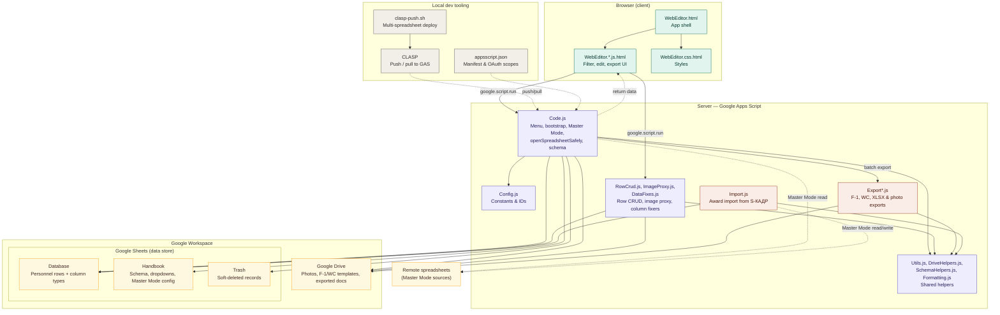

# Personnel Database

A Google Sheets–based personnel database with a built-in web editor. Data lives in a Google Sheet; the web editor provides a richer UI for browsing, editing, and exporting records.

To set it up, see [Getting started](#getting-started). Detailed reference (spreadsheet layout, features, exports, configuration) is under [Documentation](#documentation).

## How it works

The project is a [Google Apps Script](https://developers.google.com/apps-script) bound to a Google Spreadsheet, deployed locally with [CLASP](https://github.com/google/clasp). The Sheets menu (`onOpen()` in `Code.js`) opens the web editor as a modal dialog; the browser-side UI (`WebEditor.*.html`) talks to the server only through `google.script.run`. `Code.js` handles menu/dialog bootstrap, Master Mode data access, and the schema loader; row CRUD lives in `RowCrud.js`, the Drive image/PDF proxy in `ImageProxy.js`, and the menu's phone-number/full-name fixers in `DataFixes.js`. `Utils.js`, `DriveHelpers.js`, `SchemaHelpers.js`, and `Formatting.js` hold shared helpers (spreadsheet/Handbook resolution and the `*-table` codec, Drive-ID/folder resolution, schema/column lookups, and value formatting respectively), used by the server files above plus the `Export*.js` files (pure computed-value logic sits in `ExportValues.js`) and `Import.js`. All data lives in the `Database`, `Handbook` and `Trash` sheets (plus remote spreadsheets in Master Mode) and in Google Drive.



All deployable code lives in `src/` (the only directory clasp pushes); tooling and docs stay at the repo root.

| File | Purpose |
|------|---------|
| `src/Config.js` | All constants — sheet names, column names, Drive IDs, export settings |
| `src/Code.js` | Server-side script: menu, dialog bootstrap, Master Mode data access, `openSpreadsheetSafely`, schema loader |
| `src/RowCrud.js` | Row CRUD (add/update/delete) against the `Database`/`Trash` sheets |
| `src/ImageProxy.js` | Server-side Drive image/PDF/folder proxy for the client and XLSX export |
| `src/DataFixes.js` | The "Fix phone numbers"/"Fix full names" menu commands |
| `src/Utils.js` | Spreadsheet/Handbook resolution and the `*-table` cell codec |
| `src/DriveHelpers.js` | Drive-ID/URL parsing and per-unit Drive folder resolution |
| `src/SchemaHelpers.js` | Column/schema helpers: schema comparison, column lookups |
| `src/Formatting.js` | Value formatting/normalization (dates, full names, phone numbers) |
| `src/Export.js` | Server-side F-1 and Wanted Card document export |
| `src/ExportValues.js` | Pure computed-value functions for the export correspondence table (service length, relatives, awards, …) |
| `src/ExportXlsx.js` | The single-file XLSX export |
| `src/ExportPhotos.js` | The S-КАДР photo export |
| `src/Import.js` | Server-side award import from an external S-КАДР sheet |
| `src/appsscript.json` | Apps Script manifest — time zone, V8 runtime, and the Advanced Drive Service used for export thumbnails |
| `src/WebEditor.html` | Client app shell; includes CSS and JS via `<?!= HtmlService.createHtmlOutputFromFile(...) ?>` |
| `src/WebEditor.css.html` | Styles for the web editor |
| `src/WebEditor.js.html`, `WebEditor.{list,images,tables,edit,export,move}.js.html` | Client-side logic, split by view into fragments that share one global scope (included in order by `WebEditor.html`) |
| `docs/` | User-facing reference (spreadsheet setup, features, exports, configuration) and contributor-level `architecture-*.md` notes per feature area |
| `eslint.config.mjs`, `jsconfig.json` | Lint and typecheck config for `npm run check` |
| `tests/` | Node unit and contract tests (`npm test`) and the `vm` loader that runs the Apps Script sources under Node; not deployed |
| `docs/decisions/` | Short ADRs for deliberate-but-surprising design choices |
| `.github/workflows/check.yml` | CI: runs `npm run check` on pushes to `main` and on pull requests |
| `.editorconfig` | Indentation/formatting settings (also read by `shfmt`) |
| `clasp-push.sh`, `clasp-targets.json` | Multi-spreadsheet deploy script and its (git-ignored) target list |

## Features

- **List view** with per-column filters (plain text or regex), column visibility, image thumbnails, and an optional "Actual personnel" filter
- **Edit view** per person, with typed fields (dates, TIN, numbers, dropdowns, sub-tables), save-time validation, and a warning before unsaved edits are discarded
- **Add / delete** — new rows go to the local `Database` sheet; deleted rows move to `Trash` rather than being destroyed
- **Document export** — fill F-1 and Wanted Card Google Docs templates from the selected rows, or export them as a single `.xlsx`
- **Master Mode** — aggregate several unit spreadsheets in one editor and move personnel between them
- **Menu utilities** — fix phone numbers and full names in place; in Master Mode, S-КАДР photo export and award import

See [Features](docs/features.md) for the details.

## Getting started

### Prerequisites

- A Google account that can edit the target spreadsheet, which needs `Database` and `Handbook` sheets (see [Spreadsheet structure](docs/spreadsheet-setup.md#spreadsheet-structure) and [Sample files](docs/spreadsheet-setup.md#sample-files))
- [Node.js](https://nodejs.org) 20.19+ / 22.13+ (required by ESLint 10) and npm
- [`jq`](https://jqlang.github.io/jq/) — only needed for `clasp-push.sh`

### Install and connect

```bash
npm install                    # local tooling: TypeScript + ESLint
npm install -g @google/clasp   # the Apps Script CLI
clasp login
```

Create `.clasp.json` in the repo root (it's git-ignored). Use the script ID from the spreadsheet's **Extensions → Apps Script → Project Settings**:

```json
{ "scriptId": "<script-id>", "rootDir": "src" }
```

`rootDir` is required: it makes clasp push only `src/` (including `src/appsscript.json`) and never the repo-root tooling files. Re-add it if you ever regenerate the file with `clasp clone`/`clasp create`.

```bash
clasp push          # deploy src/ to the bound script project
clasp open-script   # open the Apps Script editor in the browser
```

`src/appsscript.json` (the manifest) is pushed along with the code and enables the [Advanced Drive Service](https://developers.google.com/apps-script/advanced/drive), which document export uses to fetch resized photo thumbnails — there's nothing to switch on by hand.

Then reload the spreadsheet: the **More... ⭐️** menu appears, and **Open Web Editor** launches the editor.

### First run

1. In the spreadsheet, choose **More... ⭐️ → Open Web Editor**. Google asks you to authorize the script the first time.
2. The list view shows every row of the `Database` sheet. Type in a filter box above a column to narrow the list (plain text, or regex if you toggle it).
3. Click a name in the first column to open that person's edit view, change a field and press **Save**; **← Back** returns to the list.
4. Press **Add Person** to append a new empty row and edit it straight away. **Delete** in the edit view moves a record to the `Trash` sheet.
5. Tick the checkboxes at the left of some rows, then **Export XLSX** to save them as one `.xlsx` in the Drive export folder. **Export F-1** / **Export Wanted Card** fill the Docs templates instead. All exports need the export-folder cell in `Handbook` filled in, and the document exports also need their template cells (see [Exports](docs/exports.md)).

### Deploying to multiple spreadsheets

Script IDs for all target spreadsheets are listed in `clasp-targets.json` (git-ignored — create it yourself on a fresh clone):

```json
{
  "target1": "<script-id>",
  "target2": "<script-id>"
}
```

Run `clasp-push.sh` (or `npm run clasp-push`) to `clasp push --force` to every target in sequence:

```bash
./clasp-push.sh
```

The script temporarily swaps the `scriptId` in `.clasp.json` for each target and restores the original on exit.

## Development

```bash
npm run check       # typecheck + lint + shell lint + tests, in sequence
npm run typecheck   # tsc over src/*.js against @types/google-apps-script (non-strict)
npm run lint        # ESLint over src/*.js and the client <script> fragments
npm run lint:sh     # shellcheck + shfmt -d on clasp-push.sh (needs both installed)
npm test            # node --test unit + contract tests (no dependencies)
```

There is no build step. Unit tests in `tests/` cover the pure helpers (`Utils.js`, `ExportValues.js`, client row-index bookkeeping), keep the server and client Drive-ID parsers in sync, and statically check the client/HTML contract (element ids, toolbar button classes, `template.mode`); they run under Node, not Apps Script. GitHub Actions runs `npm run check` on every push to `main` and pull request. Because JSDoc is the only source of type info, a typecheck failure often means a stale `@param`/`@returns`. Lint's main job is `no-undef` across the client fragments (linted together as one unit), which `tsc` can't see into. Feature-level internals are in [`docs/`](docs/).

## Documentation

- [Spreadsheet setup](docs/spreadsheet-setup.md) — `Database`, `Trash` and `Handbook` layout, column types, sample files
- [Features](docs/features.md) — Master Mode, custom menu, S-КАДР photo export and award import, web editor features
- [Exports](docs/exports.md) — F-1 / Wanted Card documents, computed values, XLSX export
- [Configuration](docs/configuration.md) — every `Config.js` constant
- Contributors: [Master Mode](docs/architecture-master-mode.md), [export and import](docs/architecture-export-import.md) and [web editor](docs/architecture-web-editor.md) internals
